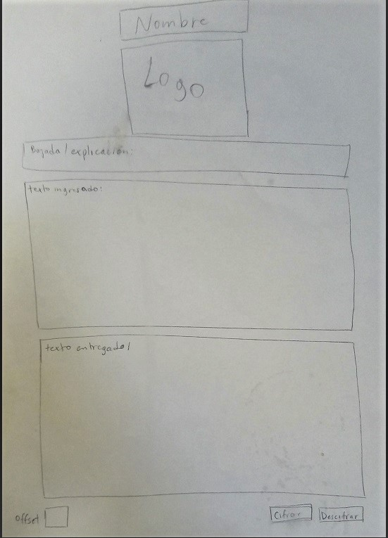
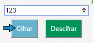

# Proyecto cifrado cesar: MeDecode.

El cifrado césar es una de las técnicas más simples para cifrar un mensaje. Es un tipo de cifrado por sustitución, es decir que cada letra del texto original es reemplazada por otra que se encuentra un número fijo de posiciones (desplazamiento) más adelante en el mismo alfabeto.

Luego de realizar una breve encuesta entre amigos con la pregunta **"¿Para qué usarías mensajes secretos?"**, la cual dio como resultado diferentes opciones; desde mensajes para acordar lugares de encuentro, hasta la necesidad de comunicar información personal confidencial. Entre ellos, algunos comentaron que como trabajadores del área de la salud (médico, psicóloga, enfermera, etc.) sería útil para ellos codificar información de pacientes para ser enviada por correo electrónico o WhatsApp a colegas, evitando tener que esperar a encontrarse en el mismo espacio físico para comunicarse y a su vez manteniendo el resguardo del contenido.

Es así como nace **MeDecode**, aplicación que permite el **cifrado y descifrado de información médica** usando para esto una clave numérica escogida por el usuario (de mutuo acuerdo entre receptor y emisor), el texto cifrado puede ser copiado y pegado en alguno de los medios de comunicación digital tradicional (correo electrónico, WhatsApp, Slack, etc.), para ser enviado entre profesionales de la salud quedando resguardado el contenido de los mensajes y puede ser descifrado haciendo uso de la misma aplicación.

## Interfaz de Usuario

Para la elección de la interfaz de usuario, se realizó un sketch a mano alzada y posteriormente en balsamiq, este se compone de una sola página en la que se despliega el área de texto a ingresar, el área de texto con la información resultante del cifrado/descifrado, un recuadro para ingresar número de cifrado y dos botones, para cifrar y descifrar respectivamente.

 

Luego de una primera puesta a prueba de la aplicación con el squad opte por mantener el contenido desplegado solo en una página, pero variar el orden de los componentes dándole una organización más lógica e intuitiva para el usuario, de la siguiente manera:

- El área para ingresar el texto a cifrar o descifrar
- El recuadro para ingresar la clave numérica
- Los botones para cifrar y descifrar
- El área donde se obtendrá el resultado del texto cifrado o descifrado 

En una segunda instancia de feedback entre squads, se mencionó que copiar el texto resultante seleccionando manualmente el contenido podría derivar en perdida de información por lo que decidí agregar un botón con esta funcionalidad y otro para limpiar las áreas de texto y recuadro de clave numérica para usar espacios nuevamente.

- Botón que permite copiar el texto resultante. 
- Botón para limpiar el contenido y volver a hacer uso de los espacios.

En cuanto a la estética y estilos de la aplicación, se buscó en repositorios de imágenes (pinterest) colores y diseños asociados a medicina y/o el área de la salud, observándose una tendencia hacia los tonos de verde, azul y blanco, los que fueron aplicados en el diseño del logo, áreas de texto y botones.

## ¿Cómo funciona?

### Para Cifrar:

- Escribe o pega el texto en la primera área de texto.

  

- Escoger una clave numérica (es necesaria para el cifrado y debes comunicarla a quien le enviaras el mensaje).

  

- Haz "click" en el botón cifrar

  

- Para traspasar el texto cifrado a tu correo, whatsapp web u otro, puedes hacer "click" en boton copiar (o  seleccionar y copiar el mensaje) y pegar en el espacio deseado.

  

- presiona el botón Limpiar para despejar las areas de texto y puedas volver a ocuparlas.

  

### Para Descifrar:

- Escribe o pega el texto cifrado en la primera área de texto.

  

- Digita la clave numérica (definida por quien envia la información).

  

- Haz "click" en el botón descifrar.

  

- Para traspasar el texto descifrado a otro espacio, puedes hacer "click" en boton copiar (o seleccionar y copiar el mensaje) y pegar en el espacio deseado.

  

- presiona el botón Limpiar para despejar las areas de texto y puedas volver a ocuparlas.

  

## Por mejorar...

Como parte del proceso se esperaba realizar test de usabilidad con usuarios que representaran el público objetivo de la aplicación (profesionales del área de la salud), sin embargo, no se lograron concretar y quedaron pendientes para una próxima fase del proyecto.

### Esta página fue construida con:

- HTML
- JavaScript
- CSS

### Autores:

- KarJC
